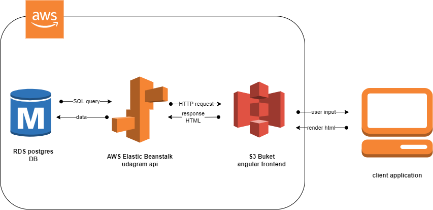

## Udagram Infrastructure

# AWS
#### RDS database
Database endpoint: `database-1.cctgeovjc1jf.us-east-1.rds.amazonaws.com`

#### Elastic Beanstalk
server is running on EBS depending on the database

server url : `http://udagram-api-dev.eba-gp9vjvfs.us-east-1.elasticbeanstalk.com/`

#### S3
front end is uploaded on S3 for static web hosting,
app url : `http://ekramy-udagram.s3-website-us-east-1.amazonaws.com/`